# Schémas des trois chantiers

Diagrammes Mermaid, rendus par GitHub. Le dossier technique (`DOSSIER_TECHNIQUE.md`) porte les mêmes flux en ASCII, lisible hors navigateur.

---

- [Chantier RAG avancé](#chantier-rag-avancé)
- [Chantier Text-to-SQL](#chantier-text-to-sql)
- [Chantier MCP et matrice d'accès](#chantier-mcp-et-matrice-daccès)

---

## Chantier RAG avancé

### 1. Schéma du RAG avancé

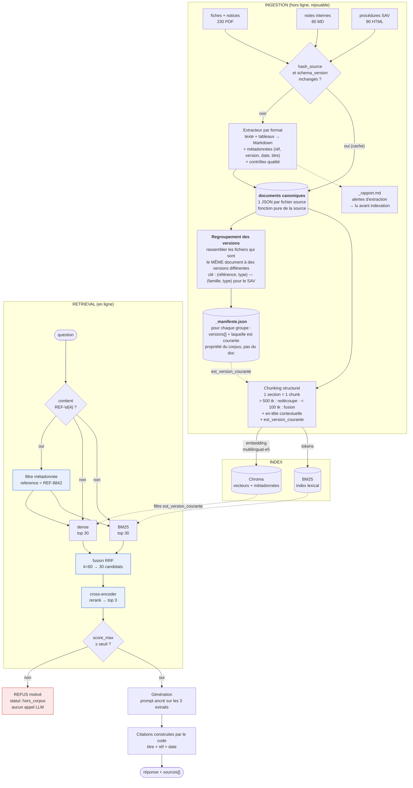

Les trois blocs bleus sont ce qui distingue « avancé » de « naïf ».
Le bloc rouge est ce qui garantit E1.

#### Le regroupement, en clair

Le corpus contient plusieurs fichiers qui sont **le même document à des versions
différentes**. Le regroupement sert uniquement à les rassembler pour savoir **laquelle est la
plus récente**. Il ne fusionne rien et ne supprime rien : chaque version reste un document
indexé à part entière.

```
                        ┌─ REF-1024-v1.0.pdf ──> doc_id  fiche_technique:REF-1024:v1.0
groupe                  │                        est_version_courante = false
"fiche_technique:REF-1024"
                        └─ REF-1024-v2.1.pdf ──> doc_id  fiche_technique:REF-1024:v2.1
                                                 est_version_courante = TRUE  ← la plus récente
```

**La clé de regroupement dépend du type**, parce que l'identité d'un document n'est pas
portée par le même champ partout :

| Type | Clé | Exemple | Pourquoi |
|---|---|---|---|
| Fiche technique | `(référence, type)` | `fiche_technique:REF-1024` | la référence produit identifie la fiche |
| Notice | `(référence, type)` | `notice:REF-1459` | idem |
| Procédure SAV | `(**famille**, type)` | `procedure_sav:proc-casse-transport-01` | une procédure n'a pas de référence produit ; son identité est sa **famille**, extraite du nom de fichier |
| Note interne | aucune | — | les notes n'ont pas de versions multiples |

Le piège du SAV : la clé est `proc-casse-transport-01`, **pas** le nom de fichier complet
`proc-casse-transport-01-v2.0`. Grouper sur le nom complet créerait un groupe d'un seul
membre par fichier — donc chaque version se croirait courante, et le filtre par défaut
laisserait passer les deux.

Ce que le regroupement produit, et rien d'autre : le **manifeste**, qui dit pour chaque
groupe quelles versions existent et laquelle est courante. Le chunking lit ensuite ce
manifeste pour écrire `est_version_courante` sur chaque chunk — là où le filtre de recherche
en a besoin.

**Mesuré sur le corpus** : 350 groupes au total, dont **50 contiennent plusieurs versions**.
Les 300 autres n'ont qu'un seul fichier, qui est donc courant d'office.

---

### 2. Modèle des chunks et métadonnées

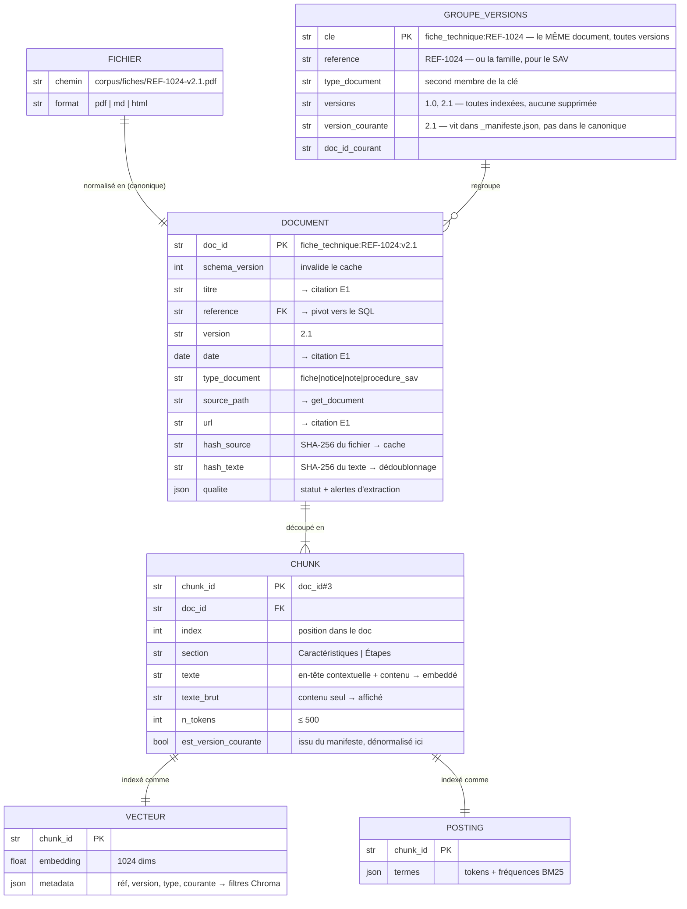

**Héritage des métadonnées** : elles vivent au niveau `DOCUMENT` mais sont **recopiées sur
chaque chunk** dans Chroma — un filtre Chroma ne peut pas faire de jointure. Dénormalisation
assumée.

**En-tête contextuelle** — la différence entre `texte` et `texte_brut` :

```
texte        = "[Fiche technique REF-1024 v2.1 — Disjoncteur différentiel
                tétrapolaire — section « Caractéristiques »]
                Calibre 40 A | Sensibilité 30 mA | Tension 400 V triphasé"
texte_brut   = "Calibre 40 A | Sensibilité 30 mA | Tension 400 V triphasé"
```

On embedde `texte` (retrouvable), on affiche `texte_brut` (lisible).

---

### 3. Tools MCP liés au RAG

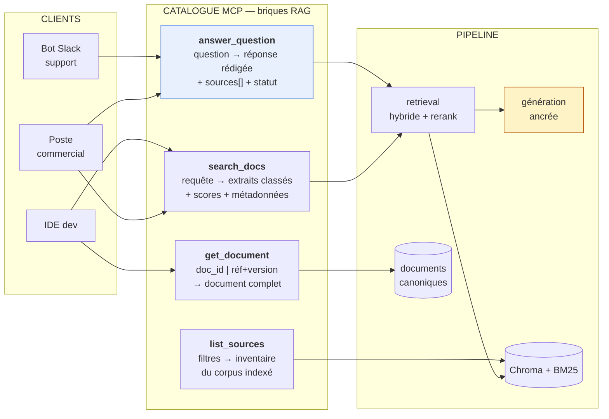

`answer_question` = `search_docs` + génération. C'est **le même retrieval**, exposé à deux
niveaux : le tool de haut niveau pour qui veut une réponse, les briques pour qui veut les
extraits bruts. Un IDE ne veut pas de prose de LLM.

| Tool | Entrées | Sorties | Garanties |
|---|---|---|---|
| `answer_question` | `question`, `collections?`, `inclure_versions_anciennes?` | `statut`, `reponse`, `sources[]` | Cite toujours (E1) · refuse sous le seuil, sans appeler le LLM |
| `search_docs` | `requete`, `k?`, `reference?`, `type_document?`, `inclure_versions_anciennes?` | `resultats[]` : `texte_brut`, `score`, métadonnées | Hybride + rerank · réf exacte en tête (E2) · pas de génération |
| `get_document` | `doc_id` \| (`reference` + `version?`) | `titre`, `texte`, métadonnées, `versions_disponibles[]` | Version courante par défaut · aucune inférence |
| `list_sources` | `type_document?`, `reference?` | `documents[]`, `total`, `collections[]` | Périmètre exact de l'index, pas du disque |

**Statuts de retour** — un client doit distinguer les trois :

| `statut` | Sens | Réaction attendue du client |
|---|---|---|
| `ok` | réponse ancrée, sources présentes | afficher |
| `hors_corpus` | le corpus ne couvre pas | dire « je ne sais pas », **ne pas** présenter comme une réponse |
| `erreur` | panne technique | remonter l'incident |

---

## Chantier Text-to-SQL

### 1. Le flux Text-to-SQL

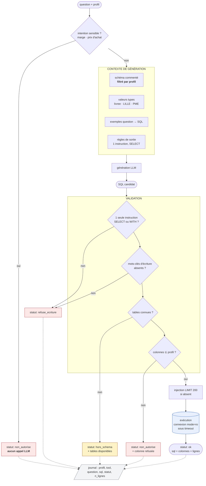

**Tout chemin se termine dans le journal**, succès comme refus (E5). Le SQL généré
accompagne la réponse dans les deux cas : voir la requête rejetée est ce qui rend le refus
compréhensible.

---

### 2. Les quatre barrières de lecture seule

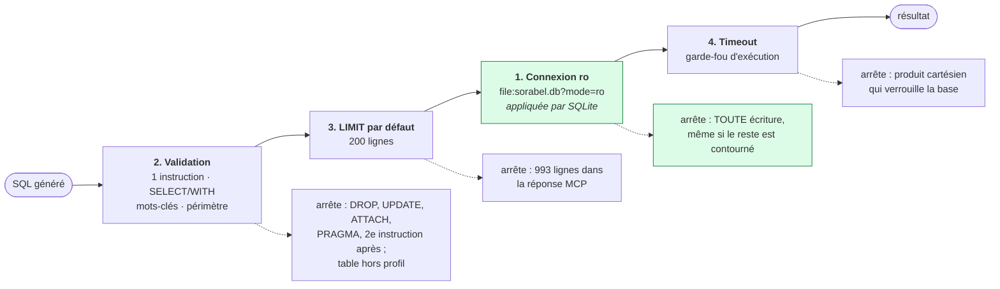

La barrière 1 est la seule **infranchissable** : elle est appliquée par le moteur, pas par
notre code. Les trois autres couvrent ce qu'elle laisse passer — une lecture parfaitement
légale mais hors périmètre, massive, ou bloquante.

---

### 3. Les quatre issues d'un appel

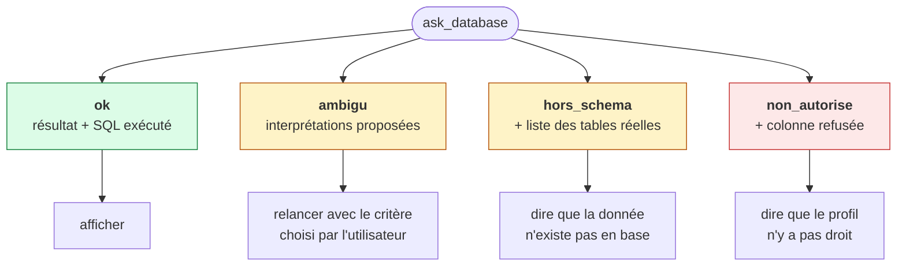

Les quatre statuts sont des **retours normaux**, jamais des exceptions. Un client doit
pouvoir les distinguer d'une panne — et distinguer « la donnée n'existe pas » de « vous n'y
avez pas droit », qui appellent des réactions différentes.

---

### 4. Modèle de données et périmètre par profil

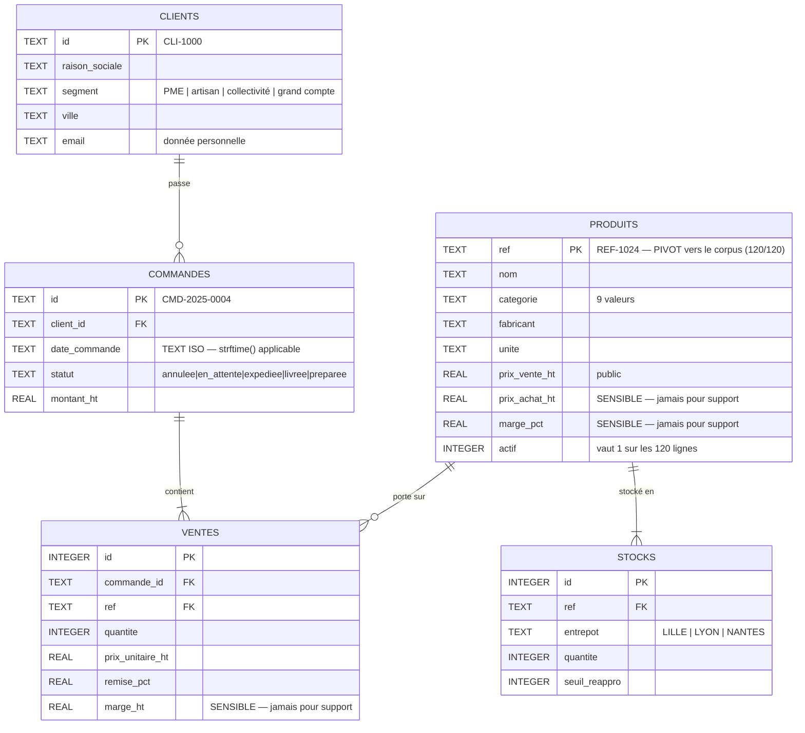

`produits.ref` porte la même valeur que la métadonnée `reference` des chunks du corpus :
c'est le seul point de contact entre les deux mondes de la Gateway, et il est complet
(120 références en base, 120 fiches, aucun orphelin).

---

## Chantier MCP et matrice d'accès

### 1. Le flux complet de la Gateway

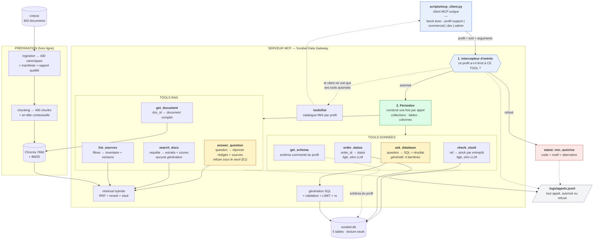

**Un seul client, quatre profils.** `scripts/mcp_client.py` prend le profil en argument. Ce
n'est pas une simplification de démonstration : c'est ce qui rend le contraste **prouvable**.
La même séquence d'appels, le même code client, le même serveur — seul le profil change, et
les réponses diffèrent. Quatre clients distincts n'auraient rien démontré : on n'aurait pas
pu écarter l'hypothèse que la différence vient du client.

Les deux tools en jaune (`answer_question`, `ask_database`) sont **les seuls qui appellent un
LLM**. Les six autres sont déterministes — ce qui explique pourquoi un IDE préfère
`search_docs` et pourquoi le support préfère `check_stock` à `ask_database` pour une question
de stock.

Le **Périmètre** (vert) est construit une fois par appel et propagé jusqu'au retrieval et au
SQL. C'est ce qui évite de dupliquer la matrice dans les huit tools tout en gardant le
contrôle au plus près de la donnée.

---

### 2. La double application de la matrice

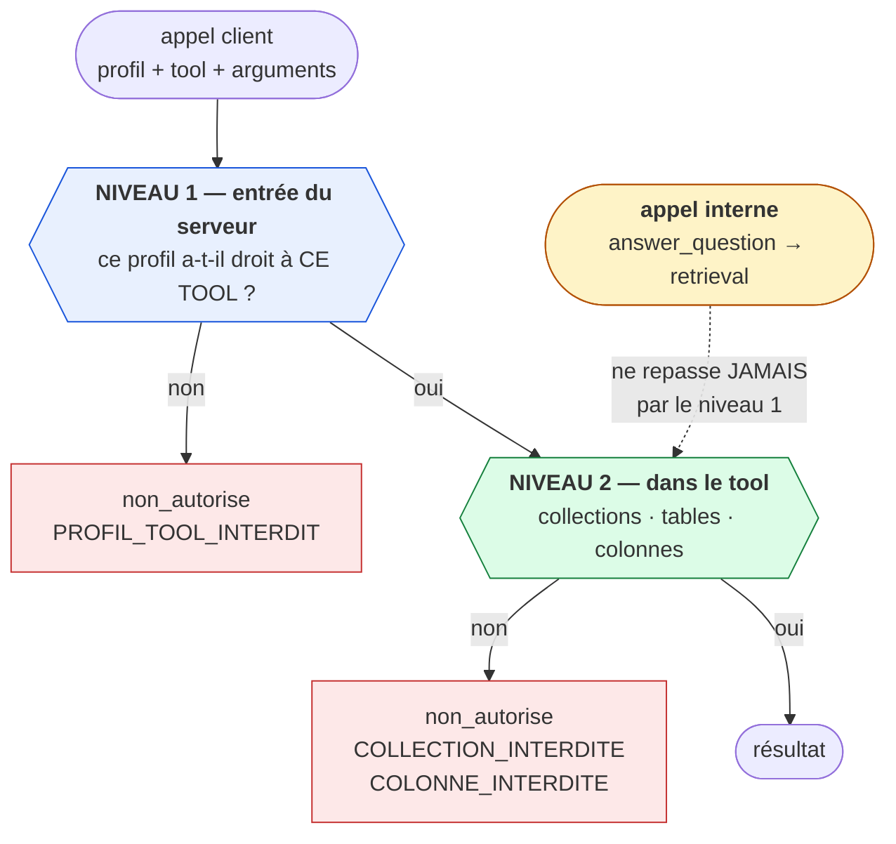

**L'angle mort que le niveau 2 comble** : `answer_question` appelle le retrieval en interne.
Si seul le niveau 1 filtrait, un profil `support` obtiendrait une réponse rédigée à partir
d'une note confidentielle — et **aucun appel non autorisé n'apparaîtrait au journal**.

---

### 3. La matrice d'accès

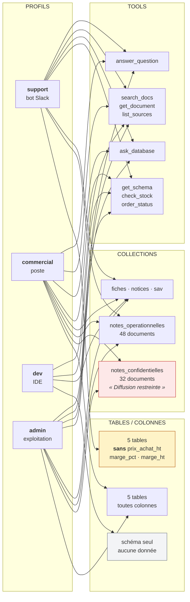

Deux refus volontaires, qui ne sont pas des oublis :

- **`dev` n'a pas `answer_question`** — un IDE veut chercher sans générer, c'est le cas
  d'usage cité par le brief.
- **`dev` n'a aucun accès aux données réelles** — `get_schema` lui donne la forme, pas le
  contenu. Un environnement de développement n'a pas à contenir les commandes des clients.

Et un accès volontairement **maintenu** : `support` conserve `ask_database`. Le refus doit
se produire *dans* le tool, sur les colonnes — sans quoi le test d'acceptance « profil
support, question sur les marges → refusée » ne pourrait pas s'exécuter.

---

### 4. Les statuts de retour

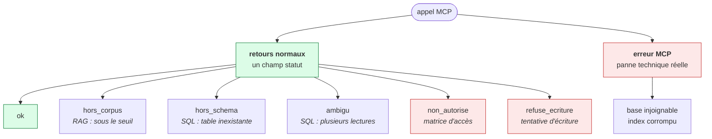

**Un refus n'est jamais une exception de protocole.** C'est la règle qui permet à un client
de distinguer « je n'ai pas la réponse » de « le serveur est en panne » — et de ne pas
présenter un refus comme une réponse.

`hors_schema` et `non_autorise` doivent rester distincts : « la donnée n'existe pas » et
« vous n'y avez pas droit » appellent des actions opposées de la part de l'utilisateur.

