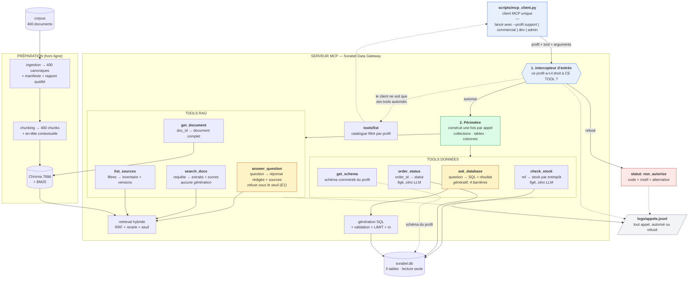
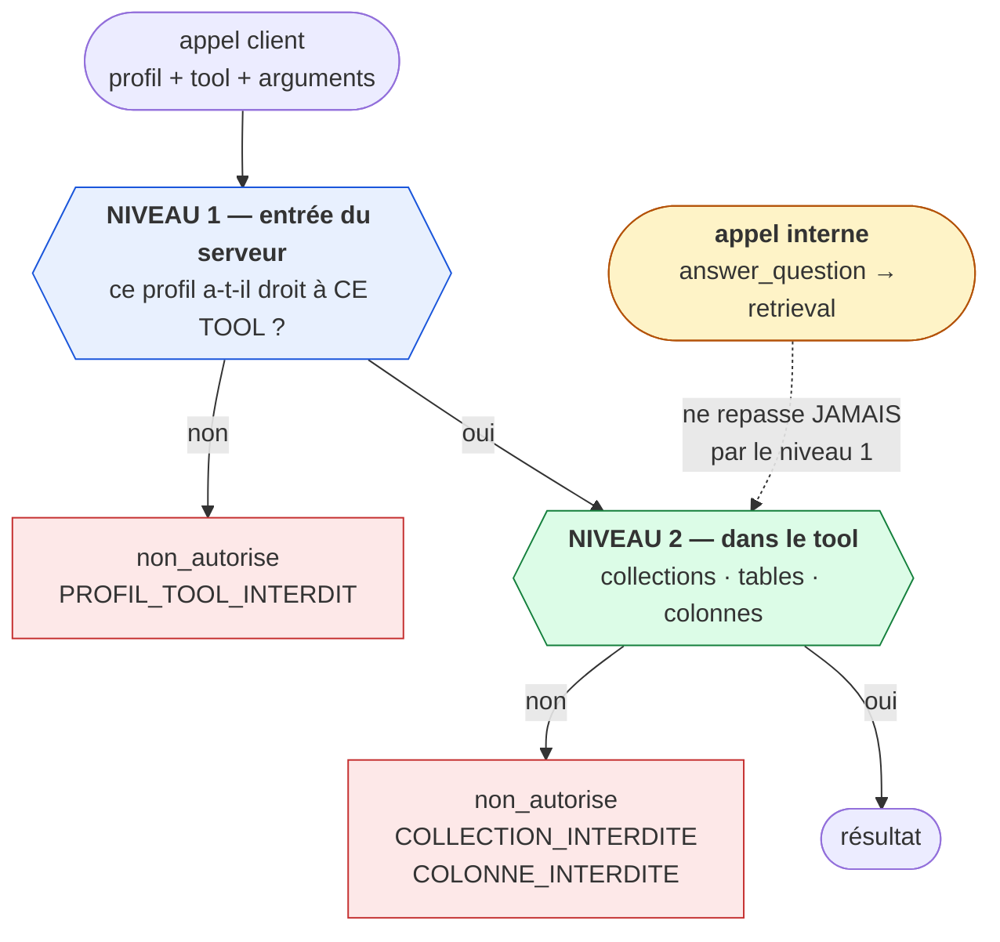
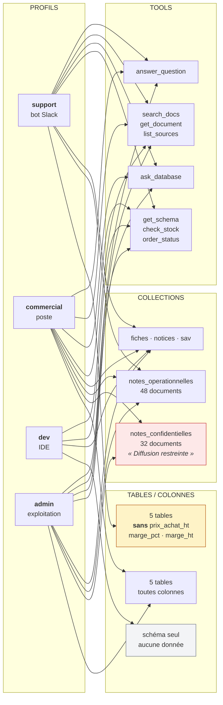
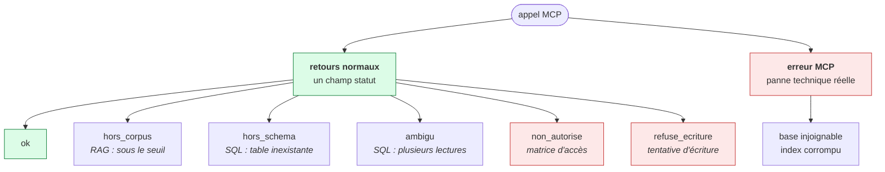

# Schémas — Chantier MCP et matrice d'accès

## 1. Le flux complet de la Gateway

**Un seul client, quatre profils.** `scripts/mcp_client.py` prend le profil en argument. Ce
n'est pas une simplification de démonstration : c'est ce qui rend le contraste **prouvable**.
La même séquence d'appels, le même code client, le même serveur — seul le profil change, et
les réponses diffèrent. Quatre clients distincts n'auraient rien démontré : on n'aurait pas
pu écarter l'hypothèse que la différence vient du client.

Les deux tools en jaune (`answer_question`, `ask_database`) sont **les seuls qui appellent un
LLM**. Les six autres sont déterministes — ce qui explique pourquoi un IDE préfère
`search_docs` et pourquoi le support préfère `check_stock` à `ask_database` pour une question
de stock.

Le **Périmètre** (vert) est construit une fois par appel et propagé jusqu'au retrieval et au
SQL. C'est ce qui évite de dupliquer la matrice dans les huit tools tout en gardant le
contrôle au plus près de la donnée.

---

## 2. La double application de la matrice

**L'angle mort que le niveau 2 comble** : `answer_question` appelle le retrieval en interne.
Si seul le niveau 1 filtrait, un profil `support` obtiendrait une réponse rédigée à partir
d'une note confidentielle — et **aucun appel non autorisé n'apparaîtrait au journal**.

---

## 3. La matrice d'accès

Deux refus volontaires, qui ne sont pas des oublis :

- **`dev` n'a pas `answer_question`** — un IDE veut chercher sans générer, c'est le cas
  d'usage cité par le brief.
- **`dev` n'a aucun accès aux données réelles** — `get_schema` lui donne la forme, pas le
  contenu. Un environnement de développement n'a pas à contenir les commandes des clients.

Et un accès volontairement **maintenu** : `support` conserve `ask_database`. Le refus doit
se produire *dans* le tool, sur les colonnes — sans quoi le test d'acceptance « profil
support, question sur les marges → refusée » ne pourrait pas s'exécuter.

---

## 4. Les statuts de retour

**Un refus n'est jamais une exception de protocole.** C'est la règle qui permet à un client
de distinguer « je n'ai pas la réponse » de « le serveur est en panne » — et de ne pas
présenter un refus comme une réponse.

`hors_schema` et `non_autorise` doivent rester distincts : « la donnée n'existe pas » et
« vous n'y avez pas droit » appellent des actions opposées de la part de l'utilisateur.
