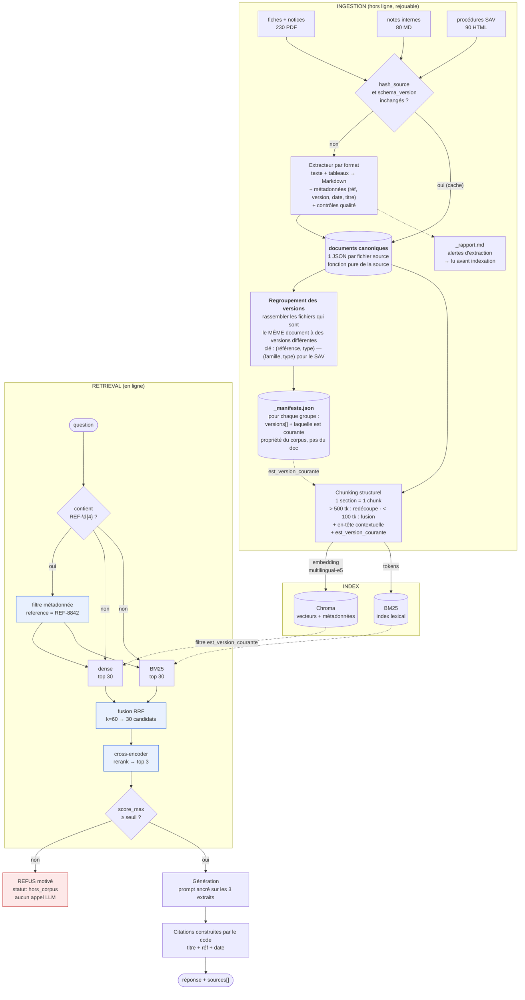
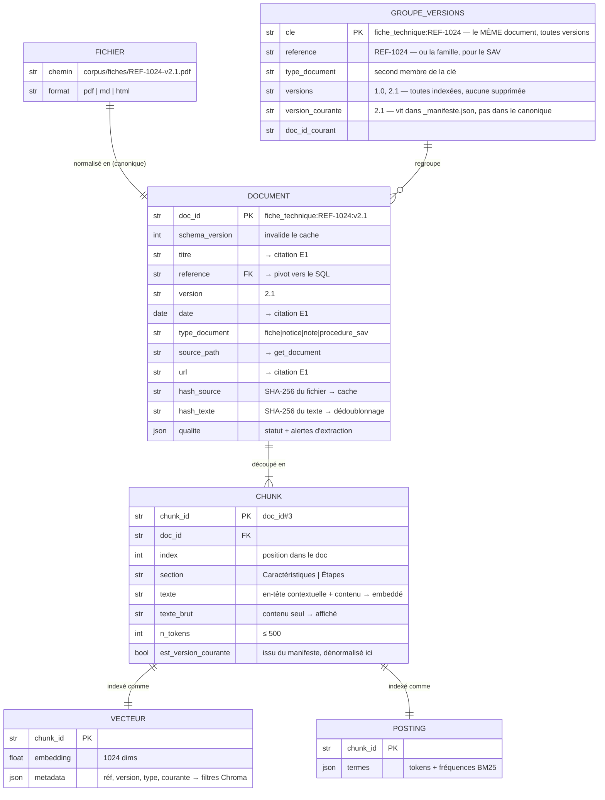
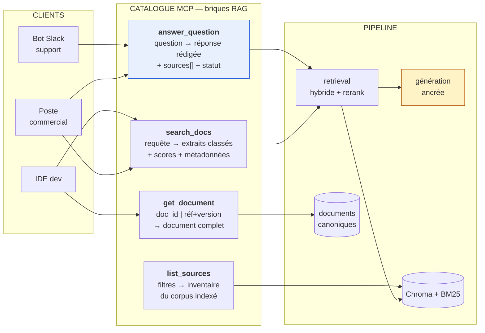

# Schémas — Chantier RAG avancé

## 1. Schéma du RAG avancé



Les trois blocs bleus sont ce qui distingue « avancé » de « naïf ».
Le bloc rouge est ce qui garantit E1.

### Le regroupement, en clair

Le corpus contient plusieurs fichiers qui sont **le même document à des versions
différentes**. Le regroupement sert uniquement à les rassembler pour savoir **laquelle est la
plus récente**. Il ne fusionne rien et ne supprime rien : chaque version reste un document
indexé à part entière.

```
                        ┌─ REF-1024-v1.0.pdf ──> doc_id  fiche_technique:REF-1024:v1.0
groupe                  │                        est_version_courante = false
"fiche_technique:REF-1024"
                        └─ REF-1024-v2.1.pdf ──> doc_id  fiche_technique:REF-1024:v2.1
                                                 est_version_courante = TRUE  ← la plus récente
```

**La clé de regroupement dépend du type**, parce que l'identité d'un document n'est pas
portée par le même champ partout :

| Type | Clé | Exemple | Pourquoi |
|---|---|---|---|
| Fiche technique | `(référence, type)` | `fiche_technique:REF-1024` | la référence produit identifie la fiche |
| Notice | `(référence, type)` | `notice:REF-1459` | idem |
| Procédure SAV | `(**famille**, type)` | `procedure_sav:proc-casse-transport-01` | une procédure n'a pas de référence produit ; son identité est sa **famille**, extraite du nom de fichier |
| Note interne | aucune | — | les notes n'ont pas de versions multiples |

Le piège du SAV : la clé est `proc-casse-transport-01`, **pas** le nom de fichier complet
`proc-casse-transport-01-v2.0`. Grouper sur le nom complet créerait un groupe d'un seul
membre par fichier — donc chaque version se croirait courante, et le filtre par défaut
laisserait passer les deux.

Ce que le regroupement produit, et rien d'autre : le **manifeste**, qui dit pour chaque
groupe quelles versions existent et laquelle est courante. Le chunking lit ensuite ce
manifeste pour écrire `est_version_courante` sur chaque chunk — là où le filtre de recherche
en a besoin.

**Mesuré sur le corpus** : 350 groupes au total, dont **50 contiennent plusieurs versions**.
Les 300 autres n'ont qu'un seul fichier, qui est donc courant d'office.

---

## 2. Modèle des chunks et métadonnées



**Héritage des métadonnées** : elles vivent au niveau `DOCUMENT` mais sont **recopiées sur
chaque chunk** dans Chroma — un filtre Chroma ne peut pas faire de jointure. Dénormalisation
assumée.

**En-tête contextuelle** — la différence entre `texte` et `texte_brut` :

```
texte        = "[Fiche technique REF-1024 v2.1 — Disjoncteur différentiel
                tétrapolaire — section « Caractéristiques »]
                Calibre 40 A | Sensibilité 30 mA | Tension 400 V triphasé"
texte_brut   = "Calibre 40 A | Sensibilité 30 mA | Tension 400 V triphasé"
```

On embedde `texte` (retrouvable), on affiche `texte_brut` (lisible).

---

## 3. Tools MCP liés au RAG



`answer_question` = `search_docs` + génération. C'est **le même retrieval**, exposé à deux
niveaux : le tool de haut niveau pour qui veut une réponse, les briques pour qui veut les
extraits bruts. Un IDE ne veut pas de prose de LLM.

| Tool | Entrées | Sorties | Garanties |
|---|---|---|---|
| `answer_question` | `question`, `collections?`, `inclure_versions_anciennes?` | `statut`, `reponse`, `sources[]` | Cite toujours (E1) · refuse sous le seuil, sans appeler le LLM |
| `search_docs` | `requete`, `k?`, `reference?`, `type_document?`, `inclure_versions_anciennes?` | `resultats[]` : `texte_brut`, `score`, métadonnées | Hybride + rerank · réf exacte en tête (E2) · pas de génération |
| `get_document` | `doc_id` \| (`reference` + `version?`) | `titre`, `texte`, métadonnées, `versions_disponibles[]` | Version courante par défaut · aucune inférence |
| `list_sources` | `type_document?`, `reference?` | `documents[]`, `total`, `collections[]` | Périmètre exact de l'index, pas du disque |

**Statuts de retour** — un client doit distinguer les trois :

| `statut` | Sens | Réaction attendue du client |
|---|---|---|
| `ok` | réponse ancrée, sources présentes | afficher |
| `hors_corpus` | le corpus ne couvre pas | dire « je ne sais pas », **ne pas** présenter comme une réponse |
| `erreur` | panne technique | remonter l'incident |
