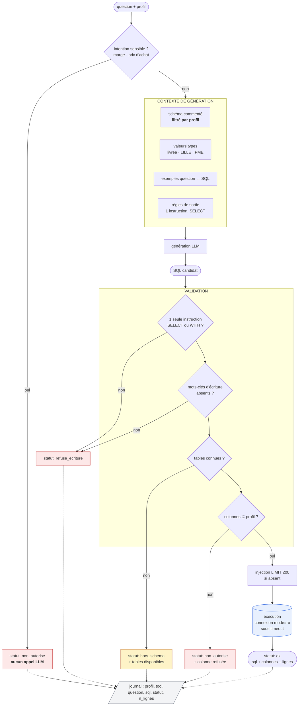
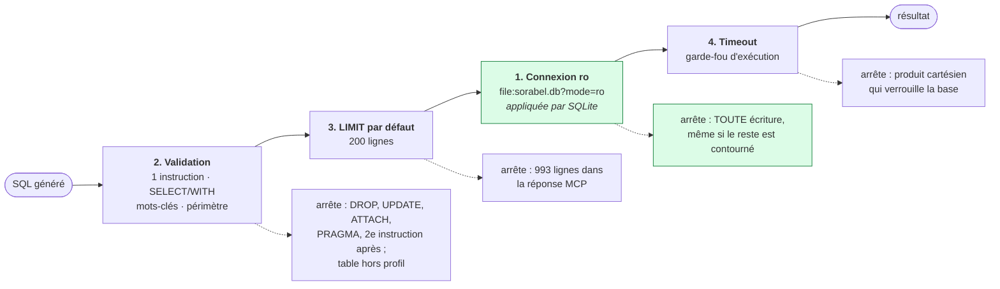
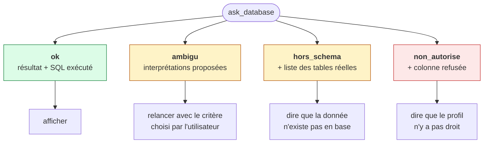
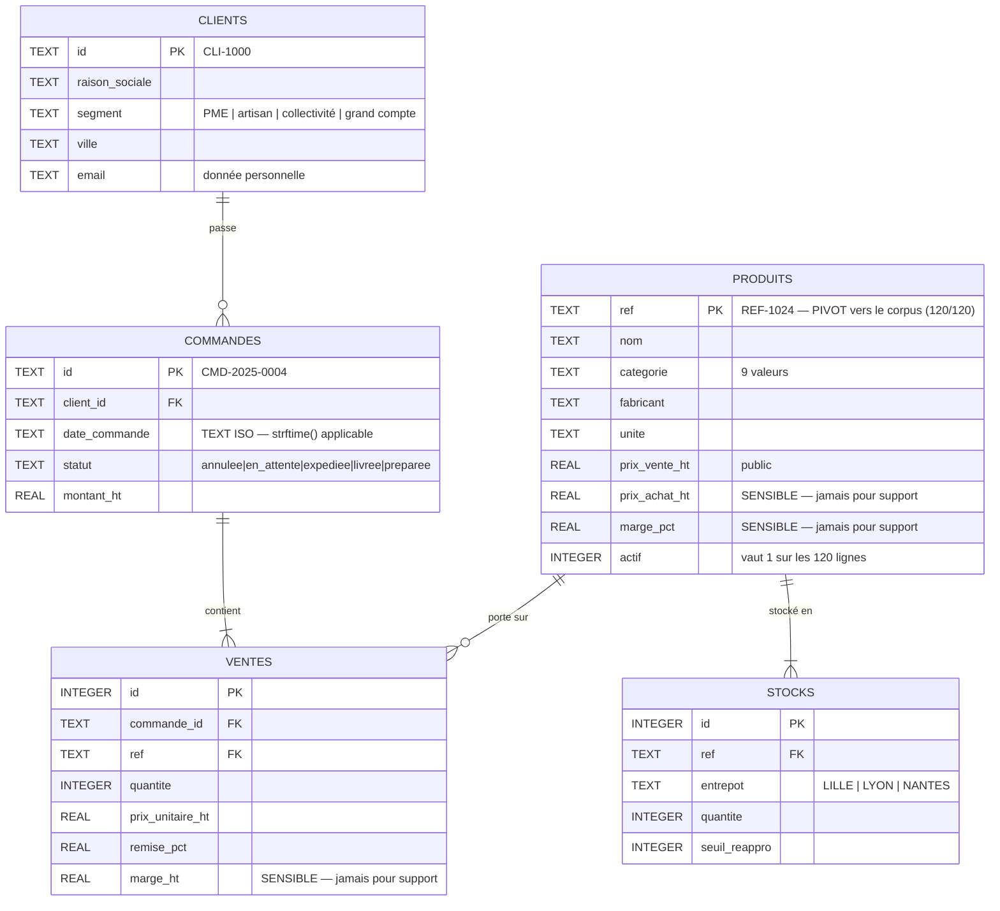

# Schémas — Chantier Text-to-SQL

## 1. Le flux Text-to-SQL

**Tout chemin se termine dans le journal**, succès comme refus (E5). Le SQL généré
accompagne la réponse dans les deux cas : voir la requête rejetée est ce qui rend le refus
compréhensible.

---

## 2. Les quatre barrières de lecture seule

La barrière 1 est la seule **infranchissable** : elle est appliquée par le moteur, pas par
notre code. Les trois autres couvrent ce qu'elle laisse passer — une lecture parfaitement
légale mais hors périmètre, massive, ou bloquante.

---

## 3. Les quatre issues d'un appel

Les quatre statuts sont des **retours normaux**, jamais des exceptions. Un client doit
pouvoir les distinguer d'une panne — et distinguer « la donnée n'existe pas » de « vous n'y
avez pas droit », qui appellent des réactions différentes.

---

## 4. Modèle de données et périmètre par profil

`produits.ref` porte la même valeur que la métadonnée `reference` des chunks du corpus :
c'est le seul point de contact entre les deux mondes de la Gateway, et il est complet
(120 références en base, 120 fiches, aucun orphelin).
